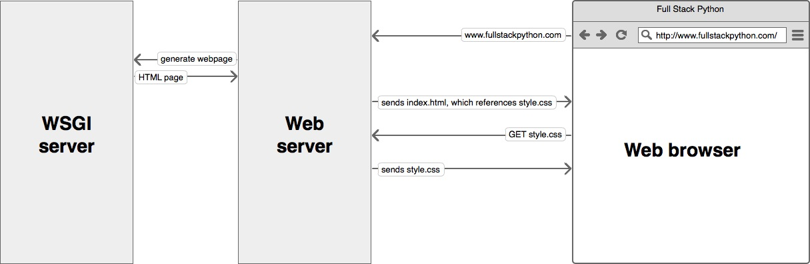

### ITSE-1042 Intermediate Python
<span style="font-family:Helvetica Neue; font-weight:bold; color:#e49436">Class 11: Chapter 19: The Goodies / Working With Excel Spreadsheets</span>
<br /><br />

-----

##### Chapter 19: The Goodies

+++++

The material we have covered in this class so far is fundamentals you need to know to get coding just about anything you wish to in Python.

Note:
Obviously this is said a little tongue in cheek, but it's a rather true statement.  We simply can't talk about every module.. even those included in the built-in library. We can't discuss every exception. We can't hit every single concept that you might use in python. Not only because you'll get buried in information, but also because you won't learn it.

+++++

Now we will talk about some alternative ways to do things and in some cases some more pythonic.

Note:
The author of our book realizes this and has saved some material toward the end to avoid overwhelming you. Obviously even with this chapter, you still won't know everything. Practice, Google, and reading documentation makes perfect. We still have 2 more classes to go, but it's a good time to talk about it. When you leave this class don't stop coding. If python is something you are serious in learning, don't stop learning when you leave the class. If you just don't do anything with the knowledge you've gotten when you leave the class, you will lose it and it will happen more quickly than you might think. This is, in part, why I encourage you to do codefights. This simple site gives you an exercise you can do nearly every day and you should do them, if nothing else, to keep sharp on the concepts. A man smarter than I that does more coding than I recommended this site to me and told me to make sure I code at least once a day even if it's just for a few minutes. I'll be the first to admit I don't do this, but it doesn't make it any less true.

+++++

##### 19.1 Conditional expressions

+++++

We saw conditional statements in Section 5.4. Conditional statements are often used to choose one of two values:

```python
if x > 0:
    y = math.log(x)
else:
    y = float('nan')
```

Note:
This statement checks whether x is positive. If so, it computes math.log. If not, math.log would raise a ValueError. To avoid stopping the program, we generate a “NaN”, which is a special floating-point value that represents “Not a Number”.

+++++

We can write this statement more concisely using a conditional expression:

```python
y = math.log(x) if x > 0 else float('nan')
```

Note:
You can almost read this line like English: “y gets log-x if x is greater than 0; otherwise it gets NaN”.

+++++

Recursive functions can sometimes be rewritten using conditional expressions. Here is a recursive version of factorial:

```python
def factorial(n):
    if n == 0:
        return 1
    else:
        return n * factorial(n-1)
```

+++++

We can rewrite it like this:

```python
def factorial(n):
    return 1 if n == 0 else n * factorial(n-1)
```

+++++

Another use of conditional expressions is handling optional arguments. For example, here is the init method from GoodKangaroo:

```python
def __init__(self, name, contents=None):
  	self.name = name
  	if contents == None:
    		contents = []
  	self.pouch_contents = contents
```

+++++

We can rewrite this one like this:

```python
def __init__(self, name, contents=None):
    self.name = name
    self.pouch_contents = [] if contents == None else contents 
```

Note:
In general, you can replace a conditional statement with a conditional expression if both branches contain simple expressions that are either returned or assigned to the same variable.

+++++

##### 19.2 List comprehensions

+++++

In Section 10.7 we saw the map and filter patterns. 

```python
def capitalize_all(t):
    res = []
    for s in t:
        res.append(s.capitalize())
    return res
```

Note:
For example, this function takes a list of strings, maps the string method capitalize to the elements, and returns a new list of strings.

+++++

We can write this more concisely using a list comprehension:

```python
def capitalize_all(t):
    return [s.capitalize() for s in t]
```

Note:
The bracket operators indicate that we are constructing a new list. The expression inside the brackets specifies the elements of the list, and the for clause indicates what sequence we are traversing.
The syntax of a list comprehension is a little awkward because the loop variable, s in this example, appears in the expression before we get to the definition.

+++++

List comprehensions can also be used for filtering.

```python
def only_upper(t):
    res = []
    for s in t:
        if s.isupper():
            res.append(s)
    return res
```

Note:
For example, this function selects only the elements of t that are upper case, and returns a new list.

+++++

```python
def only_upper(t):
    return [s for s in t if s.isupper()]
```

Note:
List comprehensions are concise and easy to read, at least for simple expressions. In addition, they are usually faster than the equivalent for loops, sometimes much faster.  
List comprehensions are harder to debug because you can’t put a print statement inside the loop. You should only use them if the computation is simple enough that you are likely to get it right the first time.

+++++

##### 19.3 Generator expressions

+++++    
Generator expressions are similar to list comprehensions. However, they use parenthesis instead of square brakets.
They are often used to iterate through a sequence of values, one value at a time. 

```python
g = (x**2 for x in range(5))
# <generator object <genexpr> at 0x7f4c45a786c0>
next(g)    # 0
next(g)    # 1

for val in g:
	print(val)

# 4
# 9
# 16
```

Note: 
The **result is a generator object** that knows how to **iterate through a sequence of values**. But unlike a list comprehension, **it does not compute the values all at once**; it waits to be asked for the next vale. The built-in function next gets the next value from the generator.
When you get to the **end of the sequence**, next raises a **StopIteration exception**. You can also use a for loop to iterate through the values.
The generator object keeps track of where it is in the sequence, so the for loop picks up where next left off.

+++++

Generator expressions are often used with functions like sum, max, and min:

```python
sum(x**2 for x in range(5))
30
```

+++++

##### 19.4 any and all

+++++

Python provides a built-in function, any, that takes a sequence of boolean values and returns True if any of the values are True. It works on lists:

```python
any([False, False, True])   # True
```

But it is often used with generator expressions:
```python
any(letter == 't' for letter in 'monty')  # True
```

Note: That example isn’t very useful because it does the same thing as the in operator. 

+++++

We could use any to rewrite some of the search functions we wrote in Section 9.3. For example, we could write avoids like this:

```python
def avoids(word, forbidden):
    return not any(letter in forbidden for letter in word)
```

Note:
The function almost reads like English, **“word avoids forbidden if there are not any forbidden letters in word**.”
**Using any with a generator expression is efficient because it stops immediately if it finds a True value, so it doesn’t have to evaluate the whole sequence.**

+++++

Python provides another built-in function that works just like any, **all**, that **returns True if every element of the sequence is True**.

+++++

##### 19.5 Sets

+++++

Previously we used dictionaries to find the words that appear in a document but not in a word list.

```python
def subtract(d1, d2):
    res = dict()
    for key in d1:
        if key not in d2:
            res[key] = None
    return res
```

Note:
The function written **takes d1, which contains the words from the document as keys**, and **d2, which contains the list of words**. 
It **returns a dictionary that contains the keys from d1 that are not in d2**.
In all of these dictionaries, **the values are None because we never use them. As a result, we waste some storage space**.

+++++

**Python provides another built-in type, called a set, that behaves like a collection of dictionary keys with no values**. Adding elements to a set is fast; so is checking membership. And sets provide methods and operators to compute common set operations.

```python
def subtract(d1, d2):
    return set(d1) - set(d2)
```

Note:
For example, **set subtraction is available as a method called difference or as an operator, -**. So we can rewrite subtract like this. 
**The result is a set instead of a dictionary, but for operations like iteration, the behavior is the same.


+++++

Some of the exercises in this book can be done concisely and efficiently with sets. For example, here is a solution to has_duplicates, from Exercise 7, that uses a dictionary:

```python
def has_duplicates(t):
    d = {}
    for x in t:
        if x in d:
            return True
        d[x] = True
    return False
```

Note:
**When an element appears for the first time, it is added to the dictionary. If the same element appears again, the function returns True.**

+++++

**Using sets, we can write the same function** like this:

```python
def has_duplicates(t):
    return len(set(t)) < len(t)
```

Note:
**An element can only appear in a set once, so if an element in t appears more than once, the set will be smaller than t.**
If there are no duplicates, the set will be the same size as t.

+++++

We can also use sets to do some of the exercises in Chapter 9. For example, here’s a version of uses_only with a loop:

```python
def uses_only(word, available):
    for letter in word: 
        if letter not in available:
            return False
    return True
```

+++++

**uses_only checks whether all letters in word are in available.** We can rewrite it like this:

```python
def uses_only(word, available):
    return set(word) <= set(available)
```

Note:
**The <= operator checks whether one set is a subset or another, including the possibility that they are equal, which is true if all the letters in word appear in available.**

+++++

##### 19.6 Counters

+++++

**A Counter is like a set, except that if an element appears more than once, the Counter keeps track of how many times it appears.**

+++++

**Counter is defined in a standard module called collections, so you have to import it. You can initialize a Counter with a string, list, or anything else that supports iteration:**

```python
from collections import Counter
count = Counter('parrot')
# Counter({'r': 2, 't': 1, 'o': 1, 'p': 1, 'a': 1})
count['d']
# 0
```

Note:
**Counters behave like dictionaries in many ways; they map from each key to the number of times it appears. As in dictionaries, the keys have to be hashable.**
Unlike dictionaries, Counters don’t raise an exception if you access an element that doesn’t appear. Instead, they return 0:

+++++

We can use Counters to rewrite is_anagram from Exercise 6:

```python
def is_anagram(word1, word2):
    return Counter(word1) == Counter(word2)
```

Note:
**If two words are anagrams, they contain the same letters with the same counts, so their Counters are equivalent!**

+++++

**Counters provide methods and operators to perform set-like operations, including addition, subtraction, union and intersection.**

```python
count = Counter('parrot')
for val, freq in count.most_common(3):
    print(val, freq) 
# r 2
# p 1
# a 1
```

Note:
As seen here, they also provide an often-useful method, most_common, which returns a list of value-frequency pairs, sorted from most common to least.

+++++

##### 19.7 defaultdict

The collections module also provides **defaultdict, which is like a dictionary except that if you access a key that doesn’t exist, it can generate a new value on the fly.**

+++++

**When you create a defaultdict, you provide a function that’s used to create new values. The built-in functions that create lists, sets, and other types can be used as factories:**

```python
from collections import defaultdict
d = defaultdict(list)
t = d['new key']
print(t)
[]
t.append('new value')
print(d)
defaultdict(<class 'list'>, {'new key': ['new value']})
```

Note:
A factory is a function that produces objects.
**Notice that the argument is list, which is a class object, not list(), which is a new list. The function you provide doesn’t get called unless you access a key that doesn’t exist.
If you are making a dictionary of lists, you can often write simpler code using defaultdict.**

+++++

**This is an example of code that can be made simpler with defaultdict:**

```python
def all_anagrams(filename):
    d = {}
    for line in open(filename):
        word = line.strip().lower()
        t = signature(word)
        if t not in d:
            d[t] = [word]
        else:
            d[t].append(word)
    return d
```

+++++

This can be simplified using setdefault, which you might have used before:

```python
def all_anagrams(filename):
    d = {}
    for line in open(filename):
        word = line.strip().lower()
        t = signature(word)
        d.setdefault(t, []).append(word)
    return d
```

Note:
This solution has the drawback that it makes a new list every time, regardless of whether it is needed. For lists, that’s no big deal, but if the factory function is complicated, it might be.

+++++

**We can avoid this problem and simplify the code using a defaultdict:**

```python
def all_anagrams(filename):
    d = defaultdict(list)
    for line in open(filename):
        word = line.strip().lower()
        t = signature(word)
        d[t].append(word)
    return d
```

+++++

##### 19.8 Named tuples

+++++

**Many simple objects are basically collections of related values. For example, the Point object defined in Chapter 15 contains two numbers, x and y.** 

+++++

When you define a class like this, you usually start with an init method and a str method:

```python
class Point:
    def __init__(self, x=0, y=0):
        self.x = x
        self.y = y

    def __str__(self):
        return '(%g, %g)' % (self.x, self.y)
```

Note:
This is a lot of code to convey a small amount of information. 

+++++

Python provides a more concise way to say the same thing:

```python
from collections import namedtuple
Point = namedtuple('Point', ['x', 'y'])
# <class '__main__.Point'>
```

Note:
**The first argument is the name of the class you want to create. The second is a list of the attributes Point objects should have, as strings. The return value from namedtuple is a class object.
Creating a named tuble Point automatically provides methods like \_\_init\_\_ and \_\_str\_\_ so you don’t have to write them.**

+++++ 

To create a Point object, you use the Point class as a function:

```python
from collections import namedtuple
Point = namedtuple('Point', ['x', 'y'])
p = Point(1, 2)
print(p)
# Point(x=1, y=2)
```

Note:
The init method assigns the arguments to attributes using the names you provided. The str method prints a representation of the Point object and its attributes.

+++++

**You can access the elements of the named tuple by name or as a normal tuple.**

```python
from collections import namedtuple
Point = namedtuple('Point', ['x', 'y'])
p = Point(1, 2)
print((p.x, p.y))
# (1, 2)
print((p[0], p[1]))
# (1, 2)
x, y = p
print((x, y))
# (1, 2)
```

+++++

**Named tuples provide a quick way to define simple classes. The drawback is that simple classes don’t always stay simple.** You might decide later that you want to add methods to a named tuple. In that case, you could **define a new class that inherits from the named tuple:**

```python
class Pointier(Point):
    # add more methods here
```

Note:
Or you could switch to a conventional class definition.

+++++

##### 19.9 Gathering keyword args

+++++

In Section 12.4, we saw how to write a function that gathers its arguments into a tuple:

```python
def printall(*args):
    print(args)
printall(1, 2.0, '3')
# (1, 2.0, '3')
printall(1, 2.0, third='3')
# TypeError: printall() got an unexpected keyword argument 'third'
```

Note:
You can call this function with any number of positional arguments (that is, arguments that don’t have keywords):
But the * operator doesn’t gather keyword arguments.

+++++

**To gather keyword arguments, you can use the ** operator:**

```python
def printall(*args, **kwargs):
    print(args, kwargs)
printall(1, 2.0, third='3')
# (1, 2.0) {'third': '3'}
```

**You can call the keyword gathering parameter anything you want, but kwargs is a common choice. The result is a dictionary that maps keywords to values.**

+++++

**If you have a dictionary of keywords and values, you can use the scatter operator, ** to call a function:**

```python
d = dict(x=1, y=2)

Point(**d)
# Point(x=1, y=2)
d = dict(x=1, y=2)
Point(d)
# Traceback (most recent call last):
#   File "<stdin>", line 1, in <module>
# TypeError: __new__() missing 1 required positional argument: 'y'
```

Note:
**Without the scatter operator, the function would treat d as a single positional argument, so it would assign d to x and complain because there’s nothing to assign to y.**

+++++


**When you are working with functions that have a large number of parameters, it is often useful to create and pass around dictionaries that specify frequently used options.**
 
 
+++++

-----


### Transforming Code into Beautiful, Idiomatic Python 
##### Raymond Hettinger's presentation and notes from PyCon US 2013 

Learn to take better advantage of Python's best features and improve existing code through a 
series of code transformations, "When you see this, do that instead."

Video: [https://www.youtube.com/watch?v=OSGv2VnC0go](https://www.youtube.com/watch?v=OSGv2VnC0go)

Notes: [https://gist.github.com/0x4D31/f0b633548d8e0cfb66ee3bea6a0deff9](https://gist.github.com/0x4D31/f0b633548d8e0cfb66ee3bea6a0deff9)
 
+++++

-----


Homework is 19.1


+++++
-----


## Using Python to Process Excel Spreadsheets
##### Python libraries for working with Excel spreadsheets 

There are several Python libraries that are very useful for working with Excel spreadsheets:   
- OpenPyXL   
-- The recommended package for reading and writing Excel 2010 files.   
- Pandas   
-- Built on NumPy and provides easy-to-use data structures and data analysis tools for Python.   
- XlsxWriter   
-- An alternative package for writing data, formatting information and, in particular, charts in the Excel 2010 format (ie: .xlsx).   
- XLTable   
-- API for writing tabular data and charts to Excel. It uses other packages as a back end to write the Excel files.   
- xlrd and xlwt (or combined xlutils) 
-- xlrd package is for reading data and formatting information from older Excel files.
-- xlwt package is for writing data and formatting information to older Excel files.

One of these libraries is **OpenPyXL**    

Helpful links for using OpenPyXL:     
https://www.pyxll.com/blog/tools-for-working-with-excel-and-python/        
https://openpyxl.readthedocs.io/en/stable/tutorial.html        
       
+++++

##### Example Python program to access and change an Excel spreadsheet

```python
# excelopenpyxl.py
import openpyxl
# Open the spreadsheet
wb = openpyxl.load_workbook('PythonTest.xlsx')
# Print the sheet names in the spreadsheet
print(wb.sheetnames)
# Assign the 3rd sheet (by name) to an object
sheet =  wb['Sheet3']
print(sheet)
print(sheet.title)

# Create a new spreadsheet
# Assign the first sheet by name to an object
sheet = wb['Sheet1']
# Display the sheet information
print('Sheet A1 =  ', sheet['A1'])
# Display the value in cell A1
print('A1.value = ', sheet['A1'].value)
# Display the B column (column 2) values in a loop
print('\nB  Value')
for i in range(1, 5):
    print('B'+ str(i), sheet.cell(row=i, column=2).value)

# Change the value in B2
sheet['B2'] = 5

# Save the updated spreadsheet to a new spreadsheet
wb.save('example_copy.xlsx')
print('Save to example_copy.xlsx Done.')

```

Output from excelopenpyxl.py:

```python
['Sheet1', 'Sheet2', 'Sheet3']
<Worksheet "Sheet3">
Sheet3
Sheet A1 =   <Cell 'Sheet1'.A1>
A1.value =  NAME
B  Value
B1 SEMESTER
B2 4
B3 6
B4 4
Save to example_copy.xlsx Done.

```

-----


## Django, Falcon, and Flask! Oh my! - An Overview of Full Stack
<br /><br /><br /><br /><br />
###### Content in part from https://www.fullstackpython.com.  A great resource for information on web frameworks.


+++++


### What is a web framework?

A web framework is a library that makes building reliable, scalable and maintainable web applications relatively easy.

+++++

### Why are web frameworks useful?

Web frameworks allow you to reuse code for common website operations. They also establish a site structure that allows any developer with knowledge of the framework to easily work on it.

+++++

### Common Web Framework Functionality

- Output templating
- URL Routing
- Login / Session tracking and management
- Database manipulation

+++++

Not all web frameworks have all or the same functionality. When evaluating different options, you will see that most are built for a specific kind of site.

Note:
A couple practical examples of this being that Django being "batteries-included" and containing just about everything you would need vs Falcon that is literally written for RESTful APIs.

+++++

Building on this, if you want to look at some specific differences, Django includes an Object-Relational Mapping layer making it so that you don't have to learn SQL to work with relational databases. This also means that you can pretty easily switch between databases as well. This does not translate well though to non-relational databases.

Frameworks like Flask and Falcon don't necessarily have a built-in ORM like Django. They can however use external modules that make working with both relational databases as well as non-relation databases relatively easy. 

+++++

### Django

Django is a widely-used Python web application framework with a "batteries-included" philosophy. The principle behind batteries-included is that the common functionality for building web applications should come with the framework instead of as separate libraries.

  

Django Tutorial -  https://www.djangoproject.com/start/   

+++++

Just a few built in features:

- Authentication
- Url Routing
- Template Engine
- Database Schema Migrations

Note:
Compare this to flask which requires an external library for authentication. The batteries-included and extensibility philosophies are simply two different ways to tackle framework building. Neither philosophy is inherently better than the other one.

+++++

#### Why Django?

The Django project's stability, performance and community have grown tremendously over the past decade since the framework's creation. Detailed tutorials and good practices are readily available on the web and in books. The framework continues to add significant new functionality such as database migrations with each release.

+++++

#### Why Django (cont)

The Django framework is a great starting place for new Python web developers because the official documentation and tutorials are some of the best anywhere in software development. Many cities also have Django-specific groups. While Austin does not currently have one, we do have a “Austin Web Python” meetup that is active. 

+++++

#### Why not Django?

Django is a lot of overhead and you will find that a lot of the “batteries” included are not needed. 

There is a lot of crazy configuration that feels like it is it’s own language in and of itself!

There is debate as to whether or not Django is beneficial to learn for novice python programmers. You will find that there is a lot to the syntax for it that isn’t “pythonic” and doesn’t necessarily make sense without really digging in. 

+++++

#### Flask

Flask is considered more Pythonic than Django because Flask web application code is in most cases more explicit. Flask is easy to get started with as a beginner because there is little boilerplate code for getting a simple app up and running.

Note:
Unlike Django, there isn't too much in the way of features to talk about and we can show the code for a simple hello world in two files.

+++++

Here's a valid "hello world" web application with Flask (the equivalent in Django would be significantly more code):

```python
from flask import Flask
app = Flask(__name__)

@app.route('/')
def hello_world():
    return 'Hello World!'

if __name__ == '__main__':
    app.run()
```

Note:
Flask was also written several years after Django and therefore learned from the Python community's reactions as the framework evolved.

+++++

#### Falcon

Falcon, of the three frameworks we will talk about, is probably the simplest and only for certain use cases. It is a WSGI-compliant web framework designed to build RESTful APIs without requiring external code library dependencies. It is very quick and very minimal.

+++++

app.py

```python
import falcon
import hello_world

api = application = falcon.API()
api.add_route('/', hello_world)
```

hello_world.py

```python
import falcon

class Resource(object):
      def on_get(self, req, resp):
         resp.body = '{"message": "Hello world!"}'
         resp.status = falcon.HTTP_200
```

+++++

#### Is that it?

Of course not. A traditional web server does not understand or have any way to run Python applications. So that means we have to find a way to run it. This is where WSGI comes in.

+++++

#### WSGI

A Web Server Gateway Interface (WSGI) server implements the web server side of the WSGI interface for running Python web applications.

+++++

In the late 1990s, a developer named Grisha Trubetskoy came up with an Apache module called mod\_python to execute arbitrary Python code. For several years in the late 1990s and early 2000s, Apache configured with mod\_python ran most Python web applications.  However, mod\_python wasn't a standard specification. It was just an implementation that allowed Python code to run on a server. 

+++++

As mod\_python's development stalled and security vulnerabilities were discovered there was a need discovered for something better. Therefore the Python community came up with WSGI as a standard interface that modules and containers could implement. WSGI is now the accepted approach for running Python web applications.

+++++



Note:
While you can start a web server with WSGI, it should only be used in development. WSGI does not completely replace a web server. It shares the responsibility with a reverse proxy such as nginx. 

+++++

Below is an example nginx configuration for a WSGI service:

```
# this specifies that there is a WSGI server running on port 8000
upstream app_server_djangoapp {
    server localhost:8000 fail_timeout=0;
}

# Nginx is set up to run on the standard HTTP port and listen for requests
server {
  listen 80;

  # nginx should serve up static files and never send to the WSGI server
  location /static {
    autoindex on;
    alias /srv/www/assets;
  }

  # requests that do not fall under /static are passed on to the WSGI
  # server that was specified above running on port 8000
  location / {
    proxy_set_header X-Forwarded-For $proxy_add_x_forwarded_for;
    proxy_set_header Host $http_host;
    proxy_redirect off;

    if (!-f $request_filename) {
      proxy_pass http://app_server_djangoapp;
      break;
    }
  }
}
```


